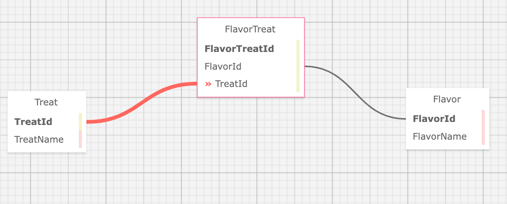
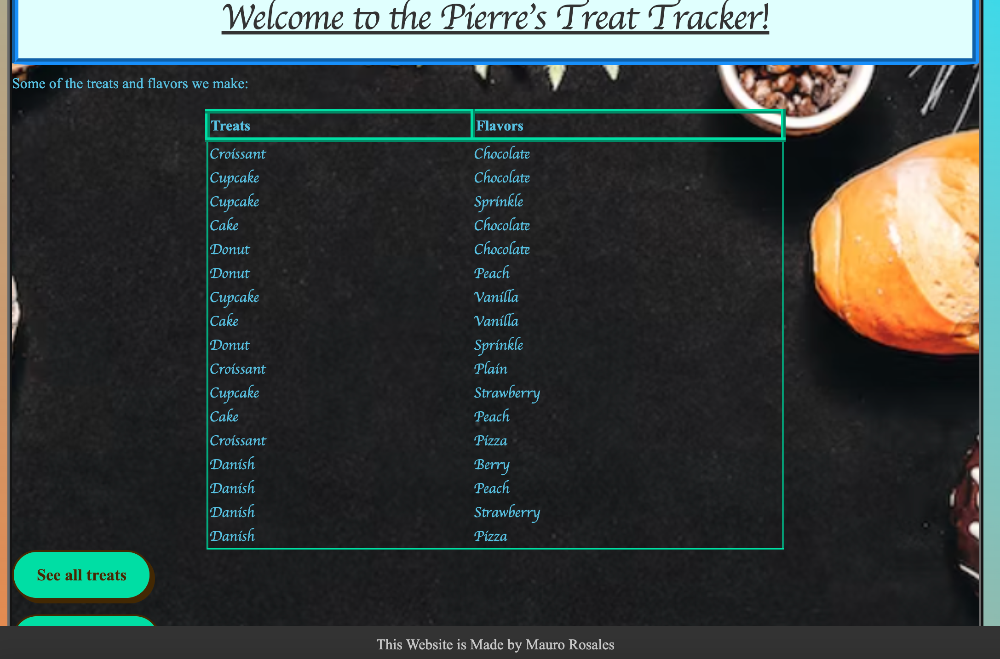
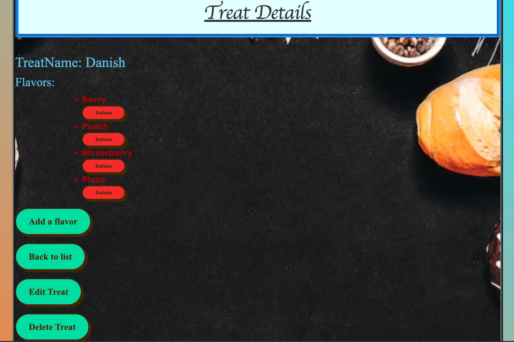
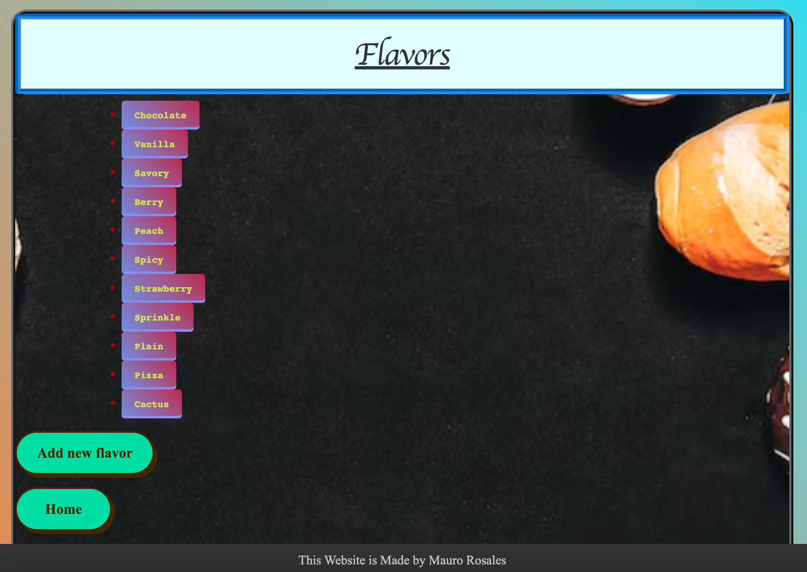

# Peirre's Treat Database

#### By Mauro Rosales jr

#### enables Pierre keep track of the treats he makes and the flavors those treats can be

## Technologies Used

* SQL
* MySQL
* VSCode
* C#
* HTML
* CSS
* Entity Framework
* LazyLoading
* MVC

## Description

Enables Pierre of Pierre's Bakery to see what treats he makes and the flavors those treats can be in. Pierre is able to log in and log out. Only logged in users should have create, update and delete functionality. All users should be able to have read functionality. 

## Setup/Installation Requirements

* clone repo from https://github.com/maurorosalesjr/Treats.Solution
* create appsettings.json file to allow user to create a SQL database to this project
* add this code to the appsettings.json file and add the missing information { "ConnectionStrings": { "DefaultConnection": "Server=localhost;Port=[PORT];database=[DATABASE NAME];uid=[UID];pwd=[PASSWORD];" } }
* make sure appsettings.json file is on the .gitignore file
* in terminal type : dotnet restore
* in terminal type : dotnet build 
*  if no errors, in terminal type : dotnet ef migrations add Initial
* the previous step will build the database
* in terminal type : dotnet ef database update
* in terminal type : dotnet run
* copy/paste : http://localhost:5000 into browser window
* use links to create and build out database like the examples below

## Sample

* Home splash page that shows everyting Pierre makes

* Adding a new treat

* Details view that allows Pierre to see what flavors this treat can be made in

* Flavors view, Pierre can click any flavor to see what treats can be made in that flavor

## Known Bugs

* CSS styling doesnt always load properly

## License

open source

for any questions or comments email me here: mauro.rosales247@gmail.com

Copyright (c) August 2022, Mauro Rosales Jr